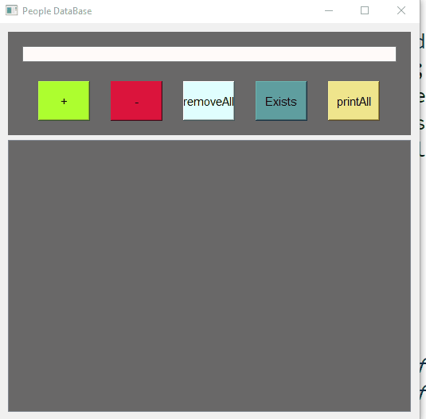
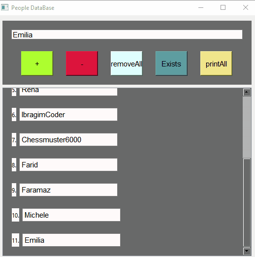
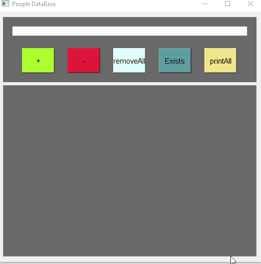
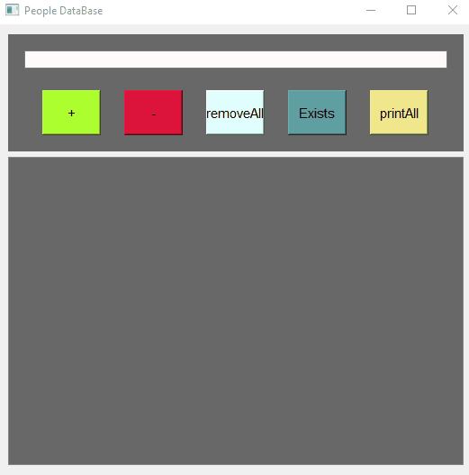

# Name Manager 📖

Welcome to Name Manager, a robust Qt-based application developed in C++ that simplifies managing a list of names with interactive and visually appealing features. Designed using the Model-View-Controller (MVC) architecture and powered by SQLite, this tool is perfect for anyone looking to efficiently handle name data.

## Key Features 🌟

- Interactive Adding: Add names to both the visual list and SQLite database with a simple click on the '+' button.
- Effortless Removal: Remove names from the list and the database by clicking the '-' button.
- Existence Verification: Check if a name exists in the database by hitting the 'exists' button, which opens a popup window with the result.
- Bulk Operations: Clear all names from the database with the 'remove_all' button and display all stored names using 'print_all'.
- Stylish Interface: Arial font size 11, gray background, snow white text views, and color-differentiated buttons make for an intuitive user experience.

## Visual Demonstrations 🎞

Explore the functionality of Name Manager through these GIFs that showcase the application in action:

  
*Adding a name*

  
*Removing a name*

  
*Removing all names*

  
*Checking if a name exists*

  
*Displaying all names*

## How to Contribute 🤝

We welcome contributions! Whether you have suggestions for improvements, bug reports, or want to add new features:

1. Fork the Project
2. Create your Feature Branch (git checkout -b feature/AmazingFeature)
3. Commit your Changes (git commit -m 'Add some AmazingFeature')
4. Push to the Branch (git push origin feature/AmazingFeature)
5. Open a Pull Request
## Installation

### Prerequisites

Before you can run Name Manager, ensure your system meets the following requirements:

- Qt 6.x: Make sure Qt 6.x is installed on your system for GUI support and framework integration.
- C++11 or later: Your compiler must support at least C++11.
- SQLite 3: As the application uses SQLite for database management, SQLite 3 must be installed.

### Clone the Repository

Start by cloning the repository to get the source code on your local machine.
## Important Configuration Note

When setting up and running the Name Manager on your local machine, you may need to update the database path to ensure the application functions correctly. The current implementation uses an absolute path to locate the people.db file, which might not correctly correspond to your filesystem structure.

### How to Update the Database Path

1. Locate the File: Open the graphic.cpp file located in your project directory.
2. Find the Database Path: Search for the line where people.db is defined. This will typically be at the top of the file.
3. Modify the Path: Replace the existing path with the absolute path to people.db on your system. For example:
   ```cpp
   // Before
   QString dbPath = "D:/Work/Qtcreator/dbmanager/people.db";

   // After
   QString dbPath = "C:/Users/[YourUsername]/path/to/people.db";
Replace YourActualUsername and your/actual/path/to with the actual path where you have stored the database file on your machine.
Also you should change dbmanager.pro
   //Before
   INCLUDEPATH += D:/SQLite3
   //After
   INCLUDEPATH += C:/"The name of the directory where the installed SQLite3 library is located"
4.Save and Rebuild:
After updating the path, save the changes in graphic.cpp, and recompile the application as previously described in the building instructions.
By ensuring the database path is correctly set, you help guarantee that the application will run smoothly on your environment, managing the name data effectively.

